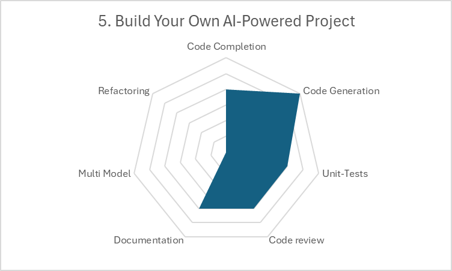

# GitHub Copilot Hackathon

Demo project for running labs to evaluate Copilot viability

- [GitHub Copilot Hackathon](#github-copilot-hackathon)
  - [Goal](#goal)
  - [Pre-requisites](#pre-requisites)
    - [IDE Extensions](#ide-extensions)
    - [Work locally](#work-locally)
  - [Challenges instructions](#challenges-instructions)
    - [Focus areas Clocks of Tempora](#focus-areas-clocks-of-tempora)
    - [The Scrolls of Eldoria](#the-scrolls-of-eldoria)
    - [API Development and CRUD Operations](#api-development-and-crud-operations)
    - [Convert powershellscript to bash](#convert-powershellscript-to-bash)
    - [Build Your Own AI-Powered Project](#build-your-own-ai-powered-project)
  - [Quick Links](#quick-links)

## Goal

The goal of a GitHub Copilot Hackathon is to learn how to use it, using a set of [exercises (labs)](#labs-instructions) that consist of building a web server using Nodejs with different functionalities, a .NET Web API or a Java Rest API (either Spring Boot or Quarkus).

We have also set two exercises for data engineers and data scientists based on python.

For those who are already familiar with GitHub Copilot, we have also defined a series of [challenges](#challenges-instructions) to test your skills. In this case, you will find an introduction and short guidance to help you solve the challenge, but you will have to do most of the work on your own (with the help of Copilot, of course).

GitHub Copilot is an AI-powered code assistant that helps developers write better code faster. It uses machine learning models trained on billions of lines of code to suggest whole lines or entire functions based on the context of what you’re working on. By using Copilot, you can learn how to write better code and improve your productivity.

Remember:

- As you type GitHub Copilot will make suggestions, you can accept them by pressing Tab.
- If nothing shows up after Copilot write some lines, press enter and wait a couple of seconds.
- Press **Ctrl + Enter**, to see more suggestions.
- Use Copilot chat to support your learning and development.
- Press **Ctrl + i** to start Copilot chat inline within your code. 

## Pre-requisites

**GitHub Copilot access**

Particpants should hve access to copilot licenses. If you still do not have an active Copilot license, request your copilot admin to assign you a copilot seat.


### IDE Extensions

Install the Copilot Extension for you IDE:

- [Visual Studio Code Copilot Extension](https://docs.github.com/en/copilot/using-github-copilot/getting-code-suggestions-in-your-ide-with-github-copilot?tool=vscode)
- [Visual Studio 2022 Copilot Extension](https://learn.microsoft.com/en-us/visualstudio/ide/visual-studio-github-copilot-extension?view=vs-2022)
- [Visual Studio 2022 Copilot Chat Extension](https://learn.microsoft.com/en-us/visualstudio/ide/visual-studio-github-copilot-chat?view=vs-2022)
- [JetBrains Copilot Extension](https://docs.github.com/en/copilot/using-github-copilot/getting-code-suggestions-in-your-ide-with-github-copilot?tool=jetbrains)

### Work locally

**VisualStudio Code**

https://code.visualstudio.com/

**Install Docker(Optional)**

https://docs.docker.com/engine/install/

**For Nodejs**

- [Install Node and npm](https://docs.npmjs.com/downloading-and-installing-node-js-and-npm)
- Install mocha: 

Run:

``` bash
 npm install --global mocha
 npm install axios
```

**For .NET**

[Install .Net](https://dotnet.microsoft.com/download)

**For Java**

- [Install Java](https://learn.microsoft.com/en-us/java/openjdk/install)
- [Install Maven](https://maven.apache.org/install.html)

**For Python**
- [Install Python](https://www.python.org/downloads/)

**For C++**
- [Install cmake](https://cmake.org/download/)


## Challenges instructions

- [Clocks of Tempora](./Challenge-1.md) 
- [The Scrolls of Eldoria](./Challenge-2.md)
- [API Development and CRUD Operations](./Challenge-3.md)
- [Convert powershellscript to bash](./Challenge-4.md)

The challenges can be categized into several core functions of Github Copilot, which you can consider to choose, which are most effective for your individual learning experience:

### Focus areas Clocks of Tempora

### The Scrolls of Eldoria

### API Development and CRUD Operations

### Convert powershellscript to bash

### Build Your Own AI-Powered Project


## Quick Links 

1. [About GitHub Copilot](https://docs.github.com/en/copilot/about-github-copilot)

2. [Getting started with GitHub Copilot](https://docs.github.com/en/copilot/using-github-copilot/getting-started-with-github-copilot)

3. [About code referencing in GitHub Copilot](https://docs.github.com/en/copilot/using-github-copilot/finding-public-code-that-matches-github-copilot-suggestions)

4. [Using GitHub Copilot Chat in your IDE](https://docs.github.com/en/copilot/github-copilot-chat/using-github-copilot-chat-in-your-ide)

5. [Enabling GitHub Copilot in the CLI](https://docs.github.com/en/copilot/github-copilot-in-the-cli/enabling-github-copilot-in-the-cli)

6. [GitHub Copilot Badges and Certifications](https://learn.microsoft.com/en-us/training/browse/?terms=github%20copilot)
