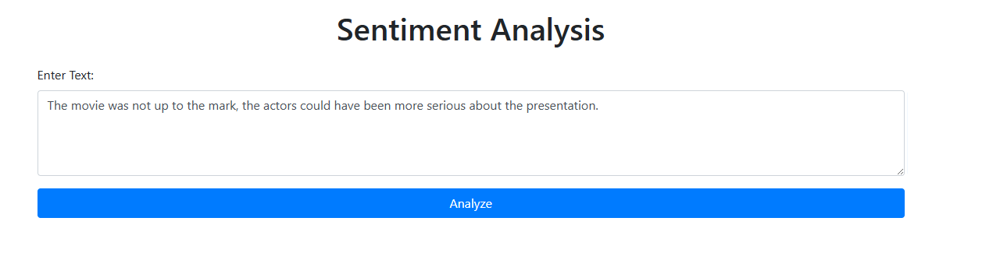
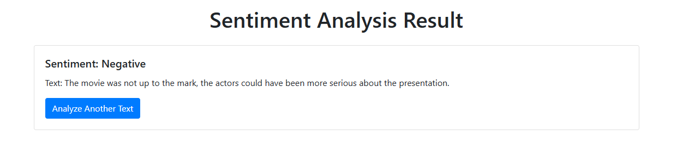
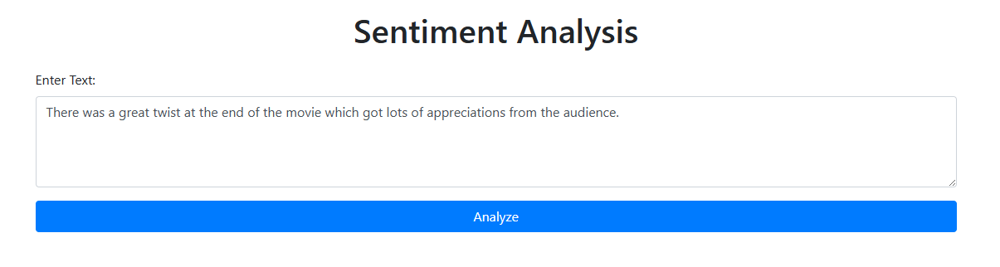
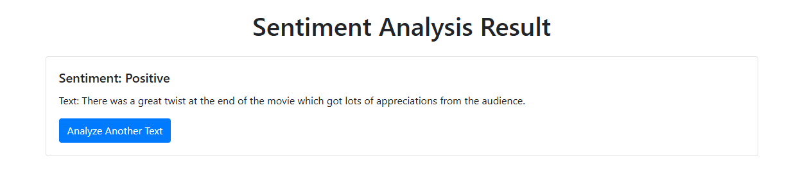

# Sentiment Analysis Application

## Developer
Tushar Mahajan (tushar.mahajan@siemens-healthineers.com)

## Description
This project is a Flask-based web application that performs sentiment analysis on user-provided text. The application uses the `textblob` library to analyze the sentiment and displays the result as positive, negative, or neutral.

## Features
- User-friendly web interface for inputting text
- Sentiment analysis using `textblob`
- Randomly displays sentiment as positive, negative, or neutral
- Modern UI using Bootstrap
- Displays the analyzed text along with the sentiment result

## Tech Stack
- Python
- Flask
- TextBlob
- Bootstrap
- GitHub Actions (for CI/CD)

## Installation
1. Clone the repository:
    ```sh
    git clone https://github.com/yourusername/Promptathon-Github.git
    cd Promptathon-Github/challenge-5
    ```

2. Create a virtual environment and activate it:
    ```sh
    python -m venv venv
    source venv/bin/activate  # On Windows, use `venv\Scripts\activate`
    ```

3. Install the required dependencies:
    ```sh
    pip install -r requirements.txt
    ```

## Running the Application
1. Run the Flask application:
    ```sh
    python app.py
    ```

2. Open your web browser and go to `http://127.0.0.1:5000/` to access the application.

## Testing
To test the application, you can use the following steps:
1. Open the web application in your browser.
2. Enter some text in the input field and click the "Analyze" button.
3. The application will display the sentiment result (positive, negative, or neutral) along with the analyzed text.

## CI/CD Pipeline
To set up a CI/CD pipeline for this project, you can use GitHub Actions. Create a new workflow file in the `.github/workflows` directory.

### /d:/Promptathon-Github/.github/workflows/ci-cd.yml
Create a new CI/CD pipeline configuration file.

```yaml
# filepath: /d:/Promptathon-Github/.github/workflows/ci-cd.yml
name: CI/CD Pipeline

on:
  push:
    branches:
      - main
  pull_request:
    branches:
      - main

jobs:
  build:
    runs-on: ubuntu-latest

    steps:
    - name: Checkout code
      uses: actions/checkout@v2

    - name: Set up Python
      uses: actions/setup-python@v2
      with:
        python-version: '3.8'

    - name: Install dependencies
      run: |
        python -m venv venv
        source venv/bin/activate
        pip install -r requirements.txt

    - name: Run tests
      run: |
        source venv/bin/activate
        python -m unittest discover -s tests
```

## Instrutions given to copilot

```
Instructions:

Your task is to act as a technical developer and help me in developing some usecase/challenge which is complex and difficult and can be solved in 2-3 hours.
The problem should utilize AI and machine learning.
Please refer all the instructions in the Challenge-5 markdown file and make sure all the points are adapted.

Make sure of the following points additional to the challenge-5 md file:
1. Create a readme md file with the detailed description of usecase or challenge.
2. Document all the points mentioned in the challenge-5 md file (do not miss any point) do not update the md file.
3. Decide the tech stack, design patter, testing, configuration and execution instructions, and all necessary aspects.
4. Please create a new folder challenge-5 and create the required document, readme, all necessary code files inside that.
```

```
Please update the configuration and execution in documentation to include creating the virtual enviroment and using challeng-5 folder
```

```
Please update the code to fix the below error while flask run command: requests.exceptions.SSLError: (MaxRetryError("HTTPSConnectionPool(host='huggingface.co', port=443): Max retries exceeded with url: /distilbert/distilbert-base-uncased-finetuned-sst-2-english/resolve/714eb0f/config.json (Caused by SSLError(SSLCertVerificationError(1, '[SSL: CERTIFICATE_VERIFY_FAILED]
```

## Screenshots



